# Mine Hammers

Idioma: [English](README.md) | **Espanol**

Mine Hammers es un mod de Fabric para **Minecraft** que agrega martillos enfocados en una mineria mas rapida y con una sensacion divertida tipo arma.

## Que Agrega Este Mod

- 14 martillos crafteables con distintas estadisticas de fuerza, velocidad, durabilidad y estilo.
- Minado en area por defecto, para romper varios bloques por golpe.
- Efectos especiales unicos en martillos seleccionados.
- Soporte de configuracion dentro del juego, incluyendo cambio de forma de minado.

## Como Funcionan Los Martillos En Juego

- Por defecto, los martillos minan en area en lugar de romper un solo bloque.
- Si miras mayormente hacia arriba o hacia abajo, el martillo mina un area horizontal.
- Si miras hacia el frente, mina un area vertical delante del jugador.
- Mantener `Shift` mientras minas desactiva temporalmente el minado en area por defecto.
- Mantener `Shift` + rueda del mouse cambia entre las formas de minado (`3x3`, `Tunel Vertical 3x1`, `Tunel Horizontal 3x1`).

## Opcion Estilo Vanilla

Si quieres mantener el minado en area pero no quieres las habilidades especiales de los martillos, puedes desactivarlas en la configuracion del mod.

- Pon `Enable Hammer Abilities` en `Off` dentro de la pantalla de configuracion.
- Los martillos seguiran funcionando como herramientas de minado en area.
- Los efectos especiales, particulas, bonos pasivos y habilidades unicas de los martillos se desactivaran globalmente.

## Lista De Martillos

Todos los martillos funcionan como herramientas tipo pico. Algunos son mejoras simples y otros tienen poderes unicos.

| Martillo | Estilo de juego / Identidad | Notas especiales |
| --- | --- | --- |
| Wooden Hammer | - | - |
| Stone Hammer | - | - |
| Iron Hammer | Herramienta confiable de media partida | Ahorra durabilidad al minar piedra y deepslate con el tiempo; el minado en area evita cofres, barriles y spawners. |
| Golden Hammer | - | - |
| Diamond Hammer | Minero confiable de endgame | Tiene 20% de probabilidad de no perder durabilidad al romper minerales; evita bloques que colapsan en minado en area como arena, arena roja y grava en el bloque principal. |
| Netherite Hammer | Martillo definitivo de late-game | El item del martillo es resistente al fuego, no el jugador; obtiene Haste cerca de lava y otras fuentes de calor. |
| Obsidian Hammer | - | - |
| Emerald Hammer | Buscador de tesoros | Al romper piedra o deepslate puede revelar minerales cercanos con particulas. |
| Lapis Hammer | - | - |
| Quartz Hammer | Resonador cristalino | Puede indicar minerales cercanos, cuarzo, cristales tipo geoda y actividad de redstone con particulas sutiles; pierde menos durabilidad en bloques del Nether y cristalinos; reduce ligeramente el agotamiento de mineria al trabajar con bloques y minerales de cuarzo. |
| Prismarine Hammer | Minero de exploracion oceanica | Mina mas rapido en agua o lluvia y un poco mas rapido a gran profundidad bajo el agua; reduce el agotamiento del minado en area bajo el agua; pierde menos durabilidad en bloques prismarine y waterlogged; puede indicar espacios inundados cercanos y monumentos oceanicos con particulas y sonidos sutiles. |
| Slime Hammer | Martillo utilitario elastico | Reduce el agotamiento del minado en area; mantiene los drops mas juntos y a veces los atrae al jugador; pierde menos durabilidad cerca de bloques de slime o slimes; puede amortiguar un poco algunas caidas e indicar slime chunks cercanos con particulas verdes. |
| Magma Hammer | Especialista de zonas calientes | Cocina automaticamente muchos drops minados; el item del martillo es resistente al fuego, no el jugador; se sobrecalienta si se usa demasiado rapido, reduciendo la velocidad de minado hasta que se enfria. |
| Ender Hammer | Explorador dimensional | Puede revelar cavidades cercanas y bordes del vacio con particulas de portal; atrae suavemente los drops hacia el jugador; reduce el agotamiento del minado en area y baja un poco el knockback cerca del vacio; pierde menos durabilidad en End Stone y bloques de purpur. |

## Crafteo

### Martillos Basicos

| Wooden Hammer | Stone Hammer | Iron Hammer |
| --- | --- | --- |
| 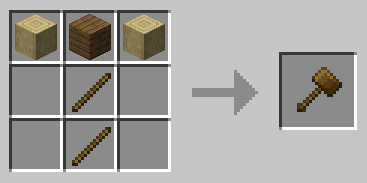 | 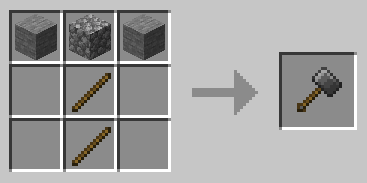 | 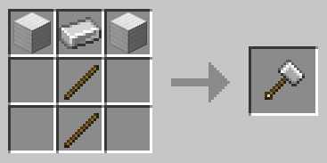 |

| Golden Hammer | Diamond Hammer | Emerald Hammer |
| --- | --- | --- |
| 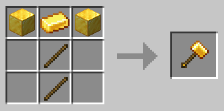 | 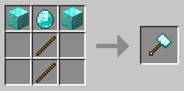 | 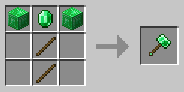 |

| Lapis Hammer | Quartz Hammer | Prismarine Hammer |
| --- | --- | --- |
| 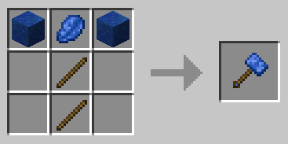 | 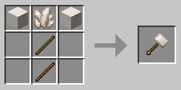 | 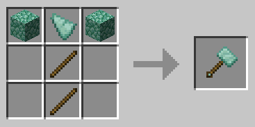 |

| Slime Hammer | Obsidian Hammer | Magma Hammer |
| --- | --- | --- |
| 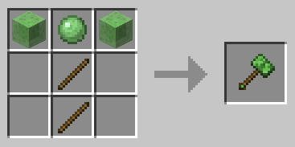 | 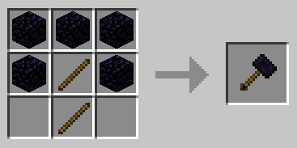 | 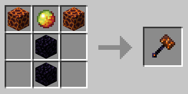 |

### Martillos De Late-Game

| Ender Hammer | Netherite Hammer |
| --- | --- |
| 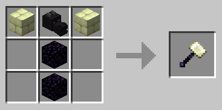 | 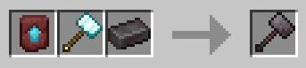 |

## Creditos

Este mod existe gracias al analisis y vibe coding con OpenAI Codex, y fue basado en el repositorio de Draylar:
https://github.com/Draylar/vanilla-hammers
